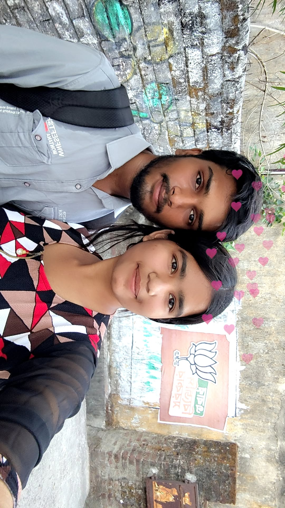

# Mummum-Birthday-
<!DOCTYPE html>
<html lang="en">
<head>
<meta charset="UTF-8">
<meta name="viewport" content="width=device-width, initial-scale=1.0">
<title>For My Mummum ❤️</title>

</head>

<body>

<audio id="bgMusic" loop>
  <source src="song.mp3" type="audio/mpeg">
</audio>

<!-- LETTER -->

  <h1>💌 For My Mummum</h1>
  
Tap to open ❤️

  <button onclick="openLetter()">Open</button>

<!-- INTRO -->

  <h1>Happy Birthday ❤️</h1>

  <h2 class="name-animation">
    
  </h2>

  

  <button onclick="nextSection('paragraph')">Read This 💌</button>

<!-- LONG PARAGRAPH -->

  <h1>For You 💖</h1>

  

    From the moment you came into my life, everything started to feel different… 
    softer, warmer, more meaningful. You are not just someone I love, you are the 
    reason behind my smiles, my peace, and my happiness. Even on my worst days, 
    just thinking about you makes everything feel okay again.

    I don’t know how you do it, but you make my heart feel safe in a way I never 
    knew was possible. Your voice, your presence, your little things… everything 
    about you feels like home to me. And maybe I don’t say it perfectly every time, 
    but I truly, deeply love you more than words can ever explain.

    I don’t just want moments with you, I want a lifetime. More memories, more 
    laughter, more love… just us, together. No matter what happens in life, I promise 
    I’ll always stand beside you, support you, and love you with everything I have.

    Happy Birthday, my Mummum… you are my heart, my happiness, and my forever ❤️
  

  <button onclick="nextSection('memories')">Our Moments 📸</button>

<!-- MEMORIES -->

  <h1>Our Memories 💕</h1>

  

    
    
    
  

  <button onclick="nextSection('end')">Final ❤️</button>

<!-- END -->

  <h1>Forever Yours ❤️</h1>
  
  <h2>Happy Birthday Mummum 🎂💖</h2>

</body>
</html>
